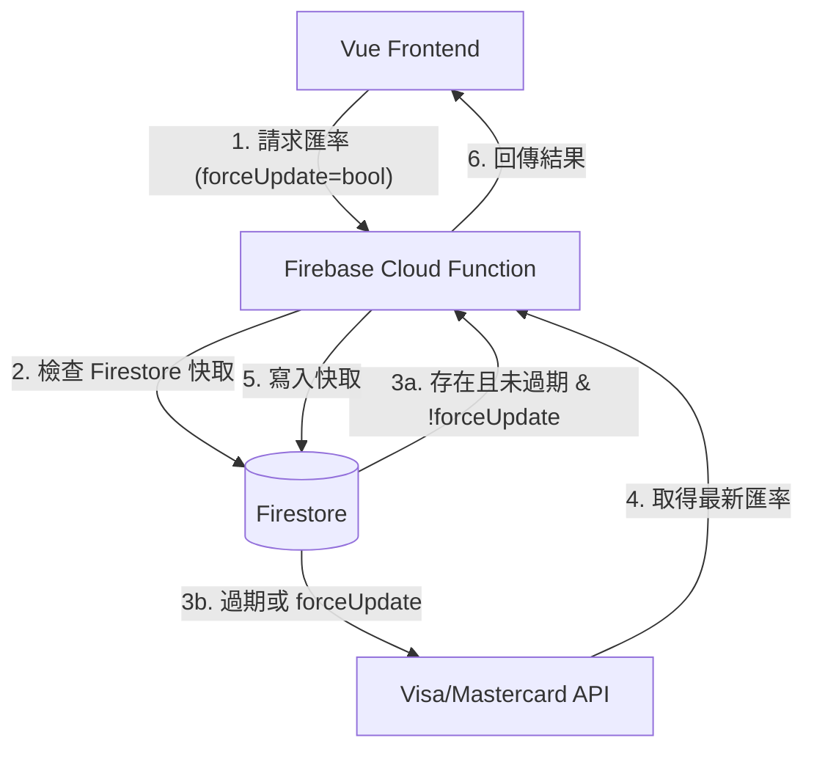

# 匯率查詢與計算功能實作規格書 (Firebase Functions & UI/UX)

本文件說明如何透過 Firebase Functions 整合發卡組織匯率 API，並於前端實作具備快取、手動更新與持久化記錄的計算介面。

---

## 1. 系統架構與快取策略

### 1.1 快取機制 (Caching Strategy)

- **單位**: 以「天」為單位進行伺服器端快取 (Firestore)。
- **自動更新**: 後端判斷若快取資料日期非今日，則自動請求 API。
- **手動更新 (Manual Force Refresh)**:
  - 前端提供「更新按鈕」。
  - 觸發時，Function 接收 `forceUpdate: true` 參數，忽略快取強制向 Visa/Mastercard 請求最新數據。

### 1.2 資料流



---

## 2. 前端介面設計規範 (UI/UX Spec)

### 2.1 組件結構

- **容器**: 採用 `@src/components/ui/BaseBottomSheet.vue`。
- **佈局**: 參考 `@src/components/trip/CollectionForm.vue` 的表單風格，維持視覺一致性。
- **頂端控制**: 使用 **Single-select segmented button** 用於切換發卡組織 (Visa / Mastercard / API 原生)。

### 2.2 樣式要求 (Style Consistency)

- **配色**: 使用 `forest-400` (主要按鈕)、`cream-light` (背景)、`forest-50` (輸入框背景)。
- **字體**: 數字使用 `font-mono` 確保對齊美觀。
- **動畫**: 開啟時使用 `slide-up` 動畫。

### 2.3 功能要點

- **歷史紀錄**:
  - 使用 `Pinia` 搭配 `localStorage` 紀錄「前一次選擇的幣別對」與「偏好的發卡組織」。
  - 當用戶再次開啟時，自動帶入上次的輸入數值與幣別。
- **即時換算**: 使用者輸入金額後，下方同步顯示換算結果（含 1.5% 海外手續費試算選配）。

---

## 3. Pinia Store 設計 (`exchangeStore`)

### 3.1 狀態定義 (State)

```typescript
{
  rates: { [key: string]: number }, // 目前匯率快取
  lastUsed: {
    from: string,      // 上次來源幣別 (預設 TWD)
    to: string,        // 上次目標幣別 (預設 JPY)
    provider: string,  // 上次發卡組織 (預設 Visa)
  },
  lastUpdated: number  // 上次更新時間戳
}
```

### 3.2 動作 (Actions)

- `fetchRate(from, to, forceUpdate)`: 調用 Firebase Function。
- `saveHistory()`: 同步 `lastUsed` 至 LocalStorage。
- `loadHistory()`: 初始化時從 LocalStorage 回填。

---

## 4. 進入點整合

- **位置**: `@src/views/SettingView.vue`。
- **形式**: 於「系統設定」群組中新增一列「匯率換算工具 (Currency Calculator)」。

---

## 5. 預期效益

1.  **使用者體驗**: 減少重複輸入，紀錄用戶常用幣別。
2.  **透明度**: 讓用戶明確知道目前匯率的來源與更新時間。
3.  **精準度**: 支援多組織匯率，符合海外旅遊實際刷卡情境。
